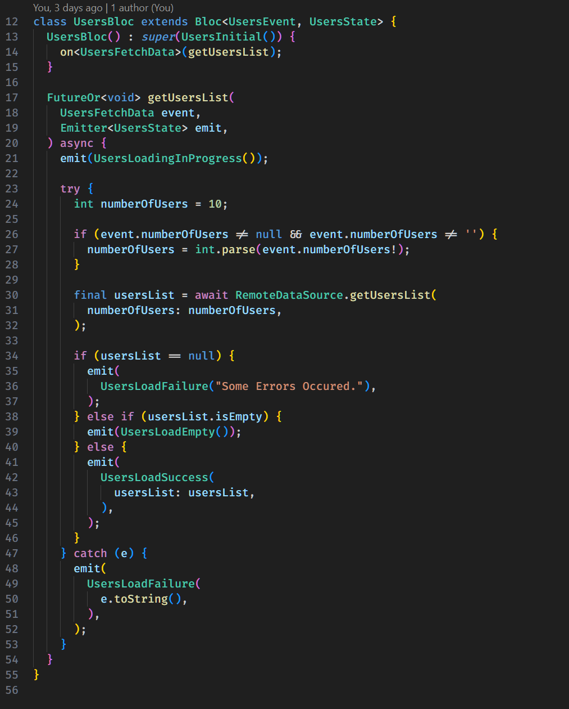
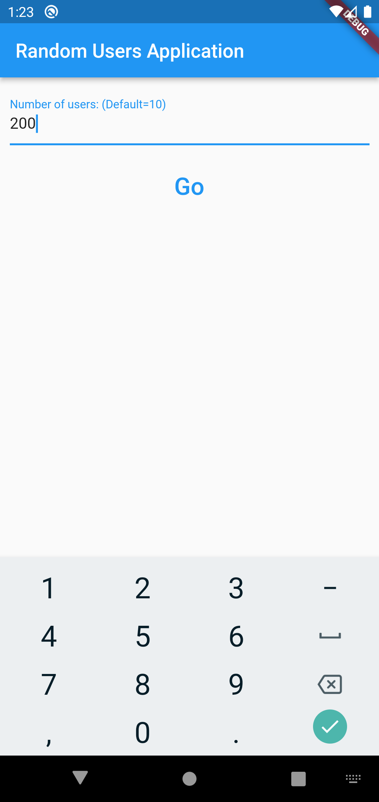
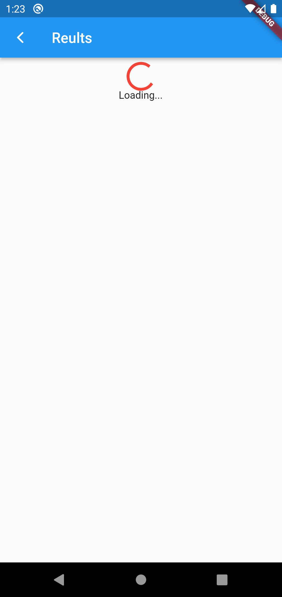

# Flutter Bloc Tutorial App - Random Users List

This Flutter application is a tutorial demonstrating the usage of Bloc architecture in combination with the [Random User Generator API](https://randomuser.me) to fetch and display a list of random users. The tutorial is part of a larger Flutter programming series that is accessible from [Faradars Bloc Tutorial](https://faradars.org/courses/bloc-architecture-in-flutter-fvflt305)).

## Table of Contents

- [Images](#Images)
- [Introduction](#introduction)
- [Features](#features)
- [Installation](#installation)
- [Usage](#usage)
- [Dependencies](#dependencies)
- [Contributing](#contributing)
- [License](#license)
- [Faradars Tutorial Link](#faradars-tutorial-link)

## Images 

Random User Bloc Code 
 


Project UI





## Introduction

This Flutter application serves as a practical guide to implementing Bloc architecture to handle API calls and display data in a Flutter project. The tutorial covers key concepts such as asynchronous operations, state management with Bloc, and integration with a REST API.

## Features

- Utilizes Bloc architecture for state management
- Fetches random user data from the [Random User Generator API](https://randomuser.me)
- Displays a list of random users with details

## Installation

To run this Flutter application locally, follow these steps:

1. Clone the repository:

   ```bash
   git clone https://github.com/your-username/your-repository.git
   ```

2. Navigate to the project directory:

   ```bash
   cd your-repository
   ```

3. Install dependencies:

   ```bash
   flutter pub get
   ```

4. Run the code generation for Dio and JsonSerializable:

   ```bash
   flutter pub run build_runner build --delete-conflicting-outputs
   ```

## Usage

After completing the installation, you can run the application on an emulator or a physical device using the following command:

```bash
flutter run
```

The application will fetch random user data from the API and display it in a list.

## Dependencies

This project uses the following dependencies:

- [flutter_bloc](https://pub.dev/packages/flutter_bloc): State management library for Flutter applications.
- [dio](https://pub.dev/packages/dio): A powerful HTTP client for Dart.
- [json_annotation](https://pub.dev/packages/json_annotation): Used for creating JSON serialization code.
- [json_serializable](https://pub.dev/packages/json_serializable): Generates utilities to aid in JSON serialization.
- [build_runner](https://pub.dev/packages/build_runner):  A build system for Dart that provides a consistent, customizable way to automate the creation of source code.

Make sure to check the `pubspec.yaml` file for the most up-to-date list of dependencies.

## Contributing

If you'd like to contribute to this project, please follow these guidelines:

1. Fork the repository
2. Create a new branch
3. Make your changes
4. Submit a pull request

### Code Style

- Follow the [Flutter style guide](https://flutter.dev/docs/development/tools/formatting) for Dart code.
- Use meaningful variable and function names to enhance code readability.

### Testing

- Ensure that your code changes are accompanied by relevant tests.
- Run existing tests to make sure they pass before submitting a pull request.

### Pull Request Template

Consider using the following template when creating a pull request:

```
## Description

[Describe your changes here]

## Checklist

- [ ] I have tested my changes thoroughly.
- [ ] My code follows the Flutter style guide.
- [ ] I have updated the documentation.
- [ ] I have added/updated tests for my changes.
```

We appreciate your contributions! Happy coding!

## License

This Flutter application is open-source and available under the [MIT License](LICENSE).

## Faradars Tutorial Link

Visit [Faradars Tutorial](https://faradars.org) for an in-depth guide on using Bloc architecture with the Random User List Flutter application.
